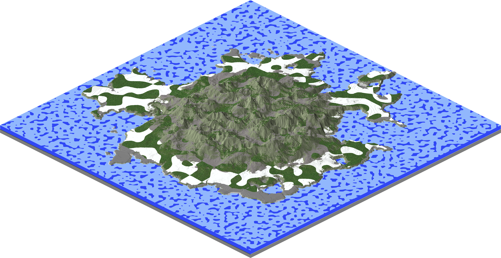
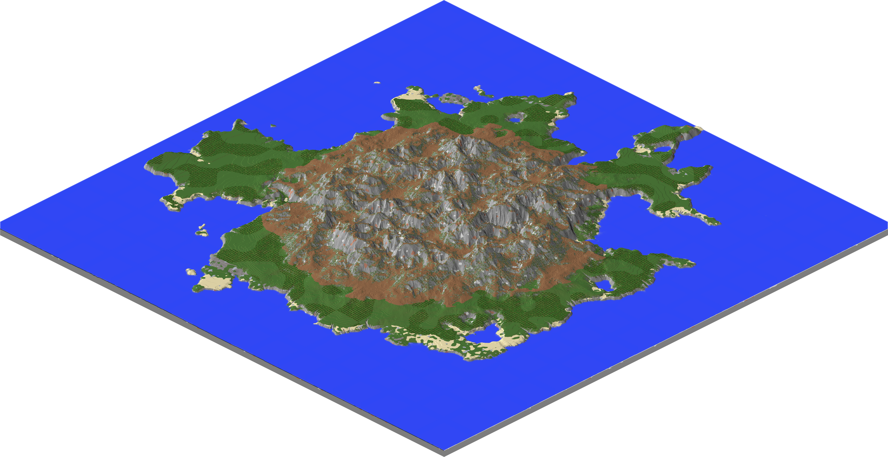
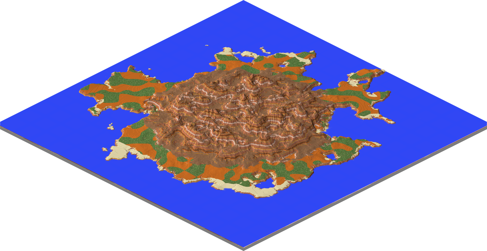
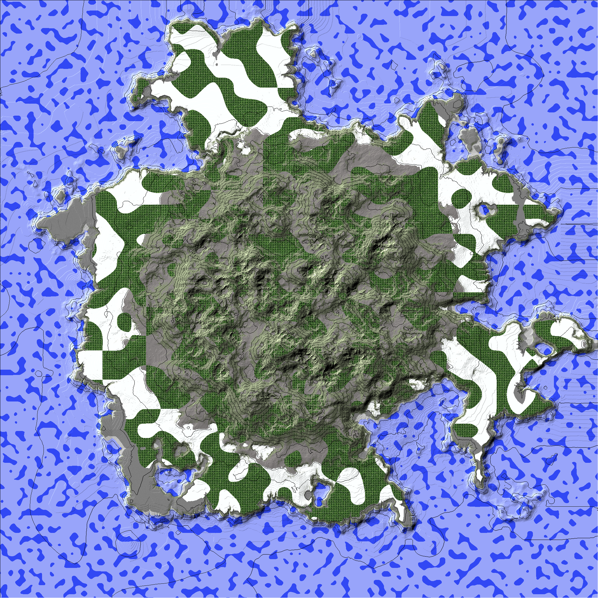
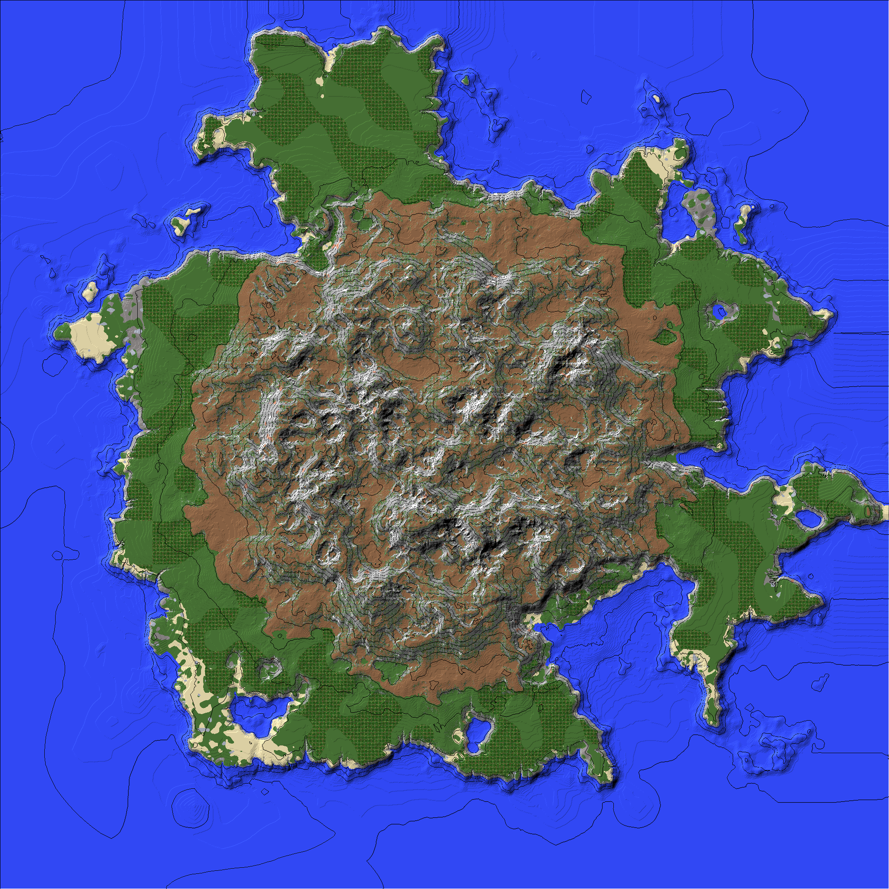
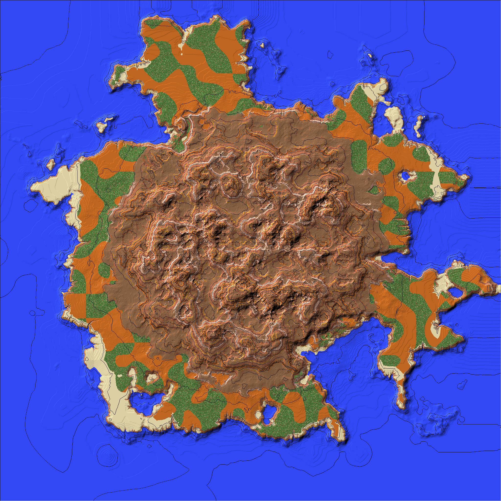
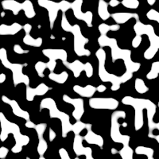

# AdvancedOperator

github: https://github.com/IR0NSIGHT/WorldPainterOperator  
latest release/download link: https://github.com/IR0NSIGHT/WorldPainterOperator/releases

The AdvancedOperator provides a way to run global operations in WorldPainter using
config files.
It supports more detailed filters than WorldPainter does, for example allowing above and below slope filters at the same time, perlin noise operators, choosing randomly from a list of terrains to set, ...

## What does it do

> Automate your terrain painting. Dont run 15 global operations by hand, save them in a config and apply with one click!

These 3 Worlds are painted with (almost) the same config, where i switched out some terrains and layers.
It took ~10 minutes to figure out nice values and paint all of them.
Since the config are saved, i can apply it to any world/heightmap/savefile now.
You can find the exact configs in docu/configs/ folder.
| Green | Continental | Mesa |
| :-------------------------------: | :-------------------------------------: | :-----------------------: |
|  |  |  |
|  |  |  |

## Running the script

Execute the script from within WorldPainter with (Top of Window)>>Tools>>Run script
select the AdvancedOperator.js file
select a config file of your liking
hit run

## Building a config

in the configs folder you will find some example configs of operations to transform your worldpainter world.
the config is written in the JSON format.

### Basic structure of config

Each config has the same basic structure, which includes a list of operations that go inside the "operations" square brackets.

```json
{
  "operations": [
    //operations will go here, separated by comma
  ]
}
```

find a most simple, working config in configs/examples/myFirstOperation.json
check out the other configs too, to see whats possible and how everything works.

### Basic structure of operations

Operations follow a basic layout. They contain a name, terrains, layers and filters.
in its most basic form an operation has a name, and (optional) some actions:

```json
{
  "name": "my first operation, all is grass",
  "terrain": 0 //set all blocks to 0, grass
}
```

```json
{
  "name": "set everything to grass/dirt and frost",
  "terrain": [0, 1], //set all blocks to grass or dirt, choose randomly
  "layer": ["Frost", 1] //set the frost layer to "ON" for all blocks
}
```

multiple operations can be run from the same config:

```json
{
  "operations": [
    { "name": "First operation, make all grass", "terrain": 0 },
    { "name": "Second operation, make all pines", "layer": ["Pines", 7] }
  ]
}
```

we will skip the "{ "operations": [...]}" wrapper from now, as it is always the same.

### Setting Terrain

If you want to set terrain in an operation, add `"terrain": 0` to your operation.
This will set the terrain to id=0, which means grass.
A list of block-ids for worldpainter can be found here: https://www.worldpainter.net/trac/wiki/Scripting/TerrainTypeValues  
Note that the IDs are worldpainter specific, not minecraft specific.

you can use `"terrain": 42` to set the terrain with id: 42.  
if you give a list of terrain: `"terrain": [42, 0, 0, 57]`, for each block the used terrain is randomly chosen from the terrain ID list (with an equal chance for all ids).  
This means that `"terrain": [0,1]` will randomly sprinkle grass(id=0) (50%) and dirt(id=1)(50%) blocks.  
`"terrain": [0,0,0,1]` will have on average 3 grass for 1 dirt.

### Setting Layers

Worldpainter layers can also be set with the config.  
It works very similar to setting terrain, with some exceptions.  
`"layer": ["Frost",1]` will set the frost layer to 1 ("ON"). `"layer": ["Pines", 7]` will set the pines layer to 7 (on a scale 0 to 15).  
If you input a list of layers to set: `"layer": [["Frost",1],  ["Pines", 7]]`, _all_ of them will be applied.  
Note that layers come in two forms: BIT layers and scalar layers.

### Bit Layers:

Frost and Void are Bit Layers: on or off.  
Setting Frost to 15 will have the same effect as "[Frost, 1]".  
use ["Frost", 0] to remove frost (or any layer)

### Scalar Layers:

Pine, Deciduous, Caves, Caverns, Chasms, Swamp, Jungle, Resources, ReadOnly, Annotations, Custom Layers

For some of these layers, 0..15 means the strength of the layer. pines = 9 means dense pine forest, pines=4 means light pine forest.  
For other layers, the number is an id: ["Annotations": 1] translates to "Annotations with Color white":  
https://www.worldpainter.net/trac/wiki/Scripting/AnnotationColours

you can also use custom layers (Ground Cover etc.) by referencing them by name. "My Custom GroundCover" f.e. (avoid spaces). Note that you should always use unique names for your custom layers, for it to work.

## Filters

You can apply your terrain and layers based on filters.
A simple operation using filters is

```json
{
  "name": "replace grass and clay with dirt",
  "onlyOnTerrain": [0, 35], //apply terrain only if the current block is grass (0) or clay (35)
  "terrain": [2]
}
```

a more complex filter using all available standardfilters:

```json
{
  "name": "high ground pines with forest floor",
  "layer": ["Pines", 7],
  "terrain": [0, 0, 0, 2, 3, 4],
  "aboveLevel": 90,
  "belowLevel": 150,
  "belowDegrees": 40, //slope
  "belowDegrees": 60,
  "onlyOnTerrain": 0,
  "onlyOnLayer": ["Frost",1]
}
```

### Block Facing

You can filter for blocks that have a free face pointing towards a direction:
`"facing": ["N", "w"]`
See "blockFacingEast.json" config for a working example

### Slope Facing

You can filter for sloped blocks where the slope is facing a direction.
See "slopeDirection.json" for a working example

#### Perlin Noise

you can use the perlin noise filter to generate natural shapes:  


```json
{
  "name": "big shape frost",
  "layer": ["Frost", 1],
  "perlin": {
    "seed": 42069.0, //noise with the same number always generates the same shape
    "scale": 100.0, //size of the "bubbles"
    "amplitude": 1.0, //dont touch
    "threshold": 0.4 //noise ranges from 0-1
  }
}
```

threshold = 0.4 means that every block with a noise value of 0.4 and higher will be filled with frost.  
amplitude is not relevant and should always stay 1.

## Limitations

All operations are global, no restriction to area operated on is possible apart from the filters.

## Planned Expansion

There is already working infrastructure in place for very complex chained filters including Perlin Noise, inverting, nesting but the config parsing does not support it yet.

Fuzzy Edges: break up transitions between areas (forest to plains) by breaking up the edge  
Smooth Transitions: similar approach but its not the edge shape thats broken up but the value of layer set (15->0 in 10 blocks range)

GUI for creating filters, possibly website based/react
